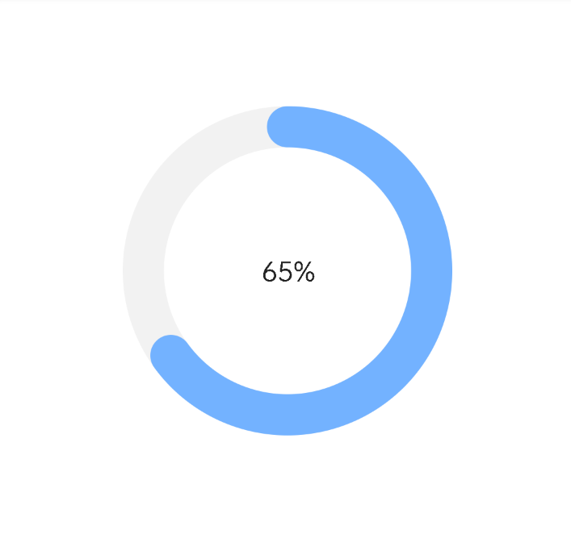
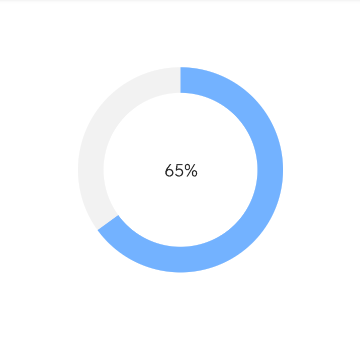

# CircleProgressView
圆圈进度条、中间进度文字（可设置是否显示）
# 效果
圆帽 strokeCapRound="true"  

非圆帽子 strokeCapRound="false"  

# 资源
|名字|资源|
|-|-|
|AAR|[circle_progress_view.aar](https://github.com/RelinRan/CircleProgressView/blob/master/circle_progress_view_2022.7.28.1.aar)|
|GitHub |[CircleProgressView](https://github.com/RelinRan/CircleProgressView)|
|Gitee|[CircleProgressView](https://gitee.com/relin/CircleProgressView)|
# Maven
1.build.grade | setting.grade
```
repositories {
	...
	maven { url 'https://jitpack.io' }
}
```
2./app/build.grade
```
dependencies {
	implementation 'com.github.RelinRan:CircleProgressView:2022.7.28.1'
}
```
# xml
~~~
<androidx.widget.CircleProgressView
    android:id="@+id/circle_progress"
    android:layout_width="match_parent"
    android:layout_height="400dp"
    android:padding="20dp"
    app:progress="65"
    app:max="100"
    app:progressTextSize="20sp"
    app:strokeCapRound="true" />
~~~
# attrs.xml
~~~
<!--进度值-->
<attr name="progress" format="integer" />
<!--进度最大值-->
<attr name="max" format="integer" />
<!--进度颜色-->
<attr name="progressColor" format="color" />
<!--进度文字-->
<attr name="progressTextVisibility" format="enum">
    <enum name="visible" value="0"></enum>
    <enum name="invisible" value="4"></enum>
</attr>
<!--进度文字-->
<attr name="progressTextSize" format="dimension" />
<!--进度文字颜色-->
<attr name="progressTextColor" format="color" />
<!--进度背景色-->
<attr name="progressBackgroundColor" format="color" />
<!--进度开始角度 0-360-->
<attr name="progressStartAngle" format="float" />
<!--圆圈线宽度-->
<attr name="progressStrokeWidth" format="dimension" />
<!--圆圈半径-->
<attr name="progressRadius" format="dimension" />
<!--是否帽圆-->
<attr name="strokeCapRound" format="boolean" />
~~~
# 使用
~~~
CircleProgressView circle_progress = findViewById(R.id.circle_progress);
circle_progress.setMax(100);
circle_progress.setProgress(65);
~~~
